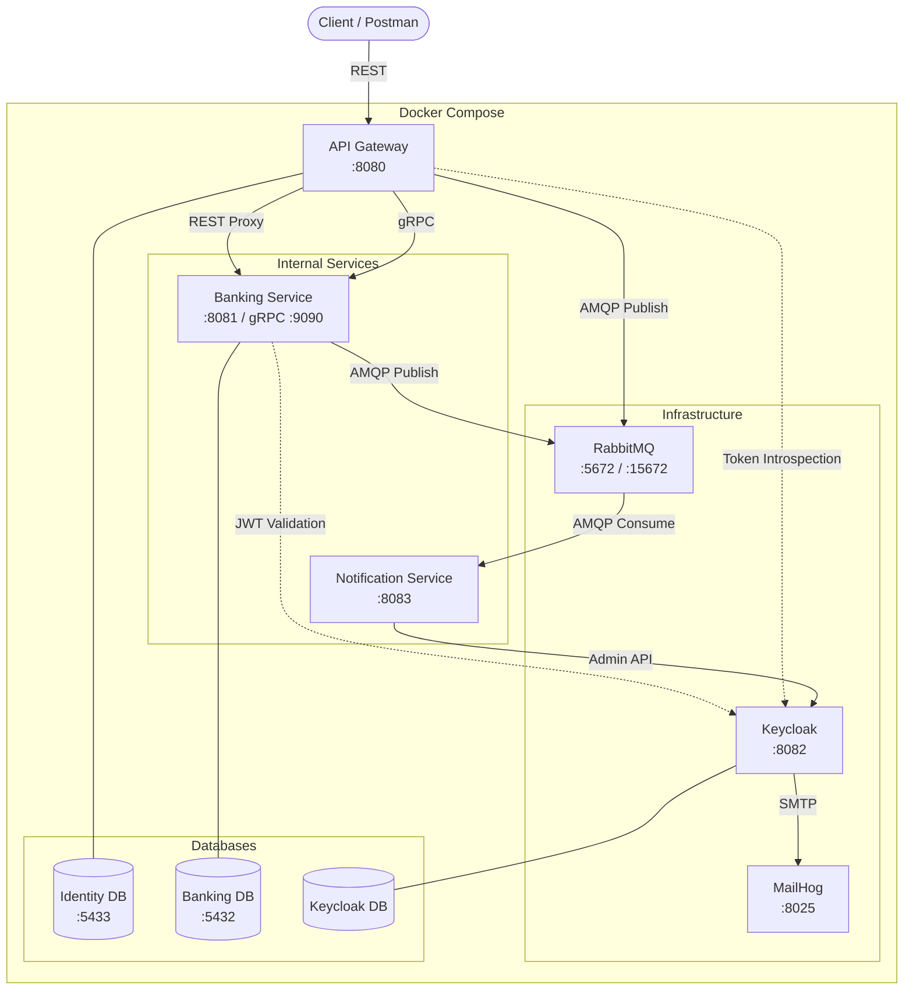

# 🏦 Core Banking Demo

A production-style **microservices banking platform** built with Spring Boot, showcasing modern backend architecture patterns including API Gateway routing, gRPC inter-service communication, event-driven messaging, and OAuth2/OIDC security.

> **Note:** This is a demonstration project. Default credentials are intentionally insecure and intended for local development only.

## Architecture



## Tech Stack

| Layer | Technology |
|---|---|
| **Language** | Java 17, Spring Boot 3 |
| **API Gateway** | Spring Cloud Gateway Server MVC (reverse proxy + auth) |
| **Internal Sync** | gRPC (protobuf) for Gateway ↔ Banking communication |
| **Async Messaging** | RabbitMQ with Dead Letter Queues |
| **Identity & Auth** | Keycloak (OAuth2 / OIDC), opaque token introspection |
| **Databases** | PostgreSQL 15 (separate DB per service) |
| **Email (Dev)** | MailHog (SMTP sink) |
| **Containerization** | Docker, Docker Compose |
| **Resilience** | Resilience4j (rate limiting) |
| **API Docs** | SpringDoc OpenAPI (Swagger UI) |

## Repositories

This project follows a **polyrepo** structure. Each service has its own Git repository:

| Repository | Description |
|---|---|
| [**Main (this repo)**](.) | Docker Compose orchestration, environment config, documentation |
| [**api-gateway-service**](https://github.com/core-banking-demo/api-gateway-service) | Authentication, user management, reverse proxy, gRPC client |
| [**banking-service**](https://github.com/core-banking-demo/banking-service) | Customer, account, and transaction management, gRPC server |
| [**notification-service**](https://github.com/core-banking-demo/notification-service) | Event-driven notifications, Keycloak email verification |

## Quick Start

### Prerequisites

- [Docker](https://docs.docker.com/get-docker/) and [Docker Compose](https://docs.docker.com/compose/install/) (v2+)
- ~4 GB free RAM (for Keycloak + 3 Postgres instances)

### Setup

```bash
# 1. Clone this repository
git clone https://github.com/core-banking-demo/core-banking-demo.git
cd core-banking-demo

# 2. Clone the service repositories
git clone https://github.com/core-banking-demo/api-gateway-service.git
git clone https://github.com/core-banking-demo/banking-service.git
git clone https://github.com/core-banking-demo/notification-service.git

# 3. Create environment file
cp .env.example .env

# 4. Build and start everything
docker compose up --build -d

# 5. Wait for all services to be healthy (~60-90 seconds)
docker compose ps
```

### Service Endpoints

| Service | URL | Credentials |
|---|---|---|
| **API Gateway** (main entry point) | http://localhost:8080 | — |
| **Swagger UI** (Gateway) | http://localhost:8080/swagger-ui.html | — |
| **Swagger UI** (Banking) | http://localhost:8081/swagger-ui.html | — |
| **Keycloak Admin Console** | http://localhost:8082 | `admin` / `admin` |
| **RabbitMQ Management** | http://localhost:15672 | `guest` / `guest` |
| **MailHog** (email inbox) | http://localhost:8025 | — |

## API Reference

All client requests go through the **API Gateway** at `http://localhost:8080`.

### Authentication (`/api/auth`)

| Method | Path | Auth | Description |
|---|---|---|---|
| `POST` | `/api/auth/register` | ❌ | Register a new user |
| `POST` | `/api/auth/login` | ❌ | Login (returns access token + refresh cookie) |
| `POST` | `/api/auth/refresh` | 🍪 Cookie | Refresh access token |
| `POST` | `/api/auth/logout` | 🍪 Cookie | Logout and invalidate session |
| `POST` | `/api/auth/verify` | ❌ | Resend email verification |
| `PUT`  | `/api/auth/password` | 🔒 Bearer | Update password |

### Banking (proxied to Banking Service)

| Method | Path | Auth | Description |
|---|---|---|---|
| `GET` | `/api/v1/customers/{publicId}` | 🔒 Bearer | Get customer profile |
| `POST` | `/api/v1/accounts` | 🔒 Bearer | Create bank account |
| `GET` | `/api/v1/accounts/{publicId}` | 🔒 Bearer | Get account details |
| `GET` | `/api/v1/accounts/customer/{customerPublicId}` | 🔒 Bearer | List customer's accounts |
| `POST` | `/api/v1/accounts/{publicId}/deposit` | 🔒 Bearer | Deposit money |
| `POST` | `/api/v1/accounts/{publicId}/withdraw` | 🔒 Bearer | Withdraw money |
| `POST` | `/api/v1/transactions/transfer` | 🔒 Bearer | Transfer between accounts |

## Architecture Decisions

### Why gRPC for Internal Communication?
The API Gateway needs to synchronously create a banking customer profile during user registration. gRPC provides type-safe contracts via Protocol Buffers, lower latency than REST, and compile-time API validation between services.

### Why RabbitMQ for Events?
Banking events (deposits, withdrawals, transfers) and user lifecycle events are published asynchronously to decouple services. Dead Letter Queues (DLQ) ensure zero message loss — failed messages are preserved for inspection and retry.

### Why Opaque Token Introspection?
The API Gateway uses Keycloak's token introspection endpoint rather than local JWT validation. This enables real-time token revocation — when a user logs out, their token is immediately invalid across all services.

### Why Separate Databases?
Each service owns its data (Database-per-Service pattern). The Identity DB stores user records, the Banking DB stores customers/accounts/transactions, and Keycloak has its own persistence. This prevents tight coupling at the data layer.

## License

This project is for educational and demonstration purposes.
